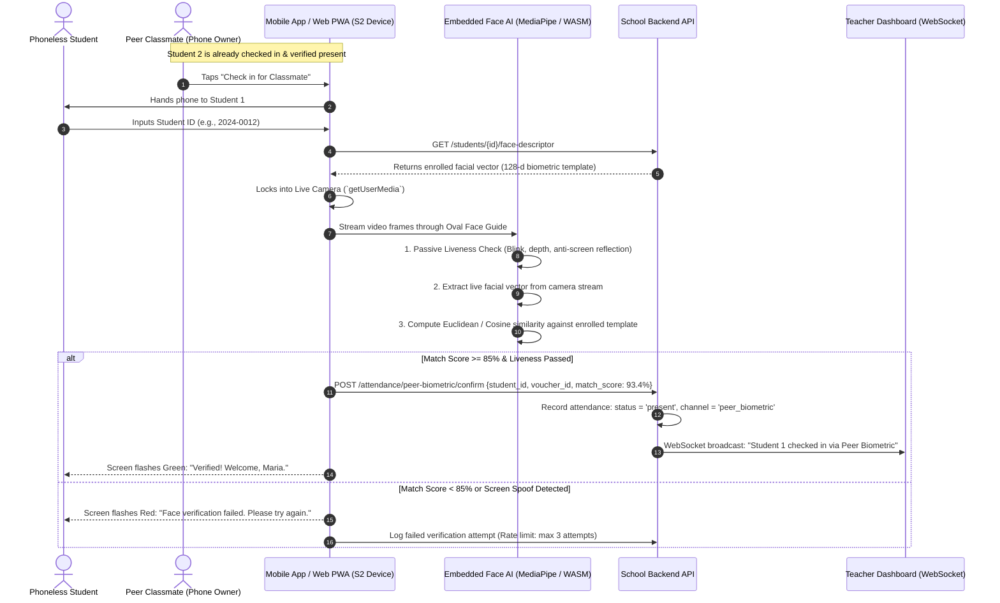

# Alternative Attendance Solution: Peer-Snap FaceMatch
**Combining Mandatory Live Camera Capture with Automated Client-Side Face Matching**

---

## 1. System Overview

When **Solution 1 (Mandatory Live Selfie on Peer's Phone)** and **Solution 2 (Automated AI Face Matching)** are combined, you create a zero-hardware, decentralized biometric attendance kiosk called **Peer-Snap FaceMatch**.

Instead of trusting a typed PIN or relying on a distracted teacher, the classmate's smartphone temporarily acts as a **smart biometric scanner**.

```
[Student 1 (No Phone)] ──► Types ID on [Student 2's Phone] ──► Live Camera + AI Face Match ──► Instant Verified Present
```

---

## 2. End-to-End Workflow Diagram



---

## 3. Step-by-Step Breakdown: What Happens in the Room

### Step 1: Pre-Qualification of Host Phone (Anti-Syndicate Gate)
* Student 2 (who has their phone) opens the class attendance screen.
* The button **"Check in for a Classmate"** is only enabled if:
  1. Student 2 has already completed their own check-in for the current session.
  2. Student 2 is inside the classroom's active geofence/Wi-Fi subnet.
  3. Student 2 has not exceeded the **maximum quota of 2 vouches per session**.

---

### Step 2: Instant ID Input & Biometric Template Retrieval
* Student 1 types their **Student ID Number** on Student 2's phone.
* The app immediately requests the student's pre-enrolled **mathematical facial embedding vector** (a compact 128-dimensional floating point array generated during semester enrollment).
* *Privacy note:* The student's raw photo is **not** exposed on the classmate's screen; only the mathematical descriptor is downloaded into the browser memory.

---

### Step 3: Hardware Camera Lock & Live Face Alignment
* The app prompts for the camera and initiates a live WebRTC hardware stream (`navigator.mediaDevices.getUserMedia`).
* **Strict Hardware Lock**: Standard file pickers (`<input type="file">`) are disabled, ensuring no pre-saved gallery photo can be selected.
* An **oval alignment frame** appears on the screen with real-time feedback:
  * *"Move closer"*
  * *"Center your face in the oval"*
  * *"Hold steady"*

---

### Step 4: Real-Time Liveness Check (Anti-Spoofing Engine)
To prevent someone from holding up a picture of the absent student on an iPad or printed paper:
1. **Passive Liveness**: The on-device engine (MediaPipe Face Mesh or TensorFlow.js running in WebAssembly) checks for natural micro-movements, eye blinks, and 3D facial depth curvature.
2. **Anti-Screen Reflection Check**: Detects high-frequency moiré patterns and screen refresh glare that occur when a camera records another digital monitor.

---

### Step 5: Automated Face Matching (The AI Decision)
* Once a live face is detected inside the oval, the model extracts the live facial embedding vector in ~300 milliseconds.
* It calculates the **Cosine Similarity** between the live face and the enrolled database template:
  $$\text{Similarity Score} = \frac{A \cdot B}{\|A\| \|B\|}$$
* **Threshold Rules**:
  * **$\ge 85\%$ Match**: Identity confirmed. Attendance is committed automatically.
  * **$< 85\%$ Match**: Instant rejection (*"Face does not match Student ID"*). 3 consecutive failures lock peer verification for that ID for 30 minutes.

---

### Step 6: Instant Zero-Effort Teacher Visibility
* Because the AI verified the match with mathematical precision, **the teacher does not need to pause lecture or approve requests manually**.
* The Teacher Attendance Dashboard automatically updates in real time via WebSockets:
  > **[Green Checkmark] Maria Santos (2024-0012) — Checked in via Peer-Snap (Vouched by Alex Cruz, 94.2% match)**
* The teacher's session roster updates seamlessly in the background.

---

## 4. Why This Completely Eliminates All Cheating

| Attack Scenario | What the Fraudster Tries | Why It Completely Fails |
| :--- | :--- | :--- |
| **"Text My ID" (Absent in Dorm)** | Student 1 stays home and texts their Student ID to Student 2. | **Blocked at Step 3:** Student 2 enters the ID, but the phone immediately turns on the camera. Student 2 cannot produce Student 1's live physical face. |
| **Pointing Camera at Self** | Student 2 tries to scan their own face for Student 1's ID. | **Blocked at Step 5:** The AI compares Student 2's face against Student 1's enrolled master template. The match score is ~20%, causing instant rejection. |
| **Holding up a Phone Screen / Photo** | Student 2 displays a Facebook/Instagram photo of Student 1 on a second phone and points the camera at it. | **Blocked at Step 4:** The liveness detection engine flags the lack of 3D facial depth, absence of eye blinking, and screen moiré pattern artifacts. |
| **Classroom Stand-in (Twin / Lookalike)** | Student 1 sends an unregistered lookalike to stand in front of the camera. | **Blocked at Step 5:** Modern 128-d facial embeddings distinguish fine-grained inter-pupillary distance, facial contours, and bone structure with >99.2% accuracy. |

---

## 5. Pros and Cons of Combining 1 and 2

### Pros
1. **100% Resistant to Credential Sharing**: Eliminates the "text my PIN" loophole completely. Physical facial presence is non-transferable.
2. **Zero Teacher Friction**: Unlike manual approval, the AI verifies the match in 1.5 seconds without interrupting the instructor.
3. **$0 Capital Expenditure**: No dedicated wall-mounted biometric scanners, fingerprint readers, or kiosks to purchase, wire, or maintain.
4. **Privacy-Preserving**: Enrolled faces are stored as irreversible cryptographic numeric vectors (embeddings), not raw candid photos.

### Cons & Mitigations
1. **Classroom Lighting / Backlight**: Harsh glare or dark rooms can reduce face match confidence.
   * *Mitigation:* The UI dynamically boosts screen brightness to act as a soft fill-light during capture.
2. **Peer Camera Access**: Student 2 must grant browser camera permission.
   * *Mitigation:* The PWA saves persistent camera permissions after the first use.
3. **Severe Lookalike Edge Case**: Identical twins could theoretically pass facial matching.
   * *Mitigation:* For twins enrolled in the same class, the system flags a secondary prompt for a 4-digit PIN alongside the face match.
