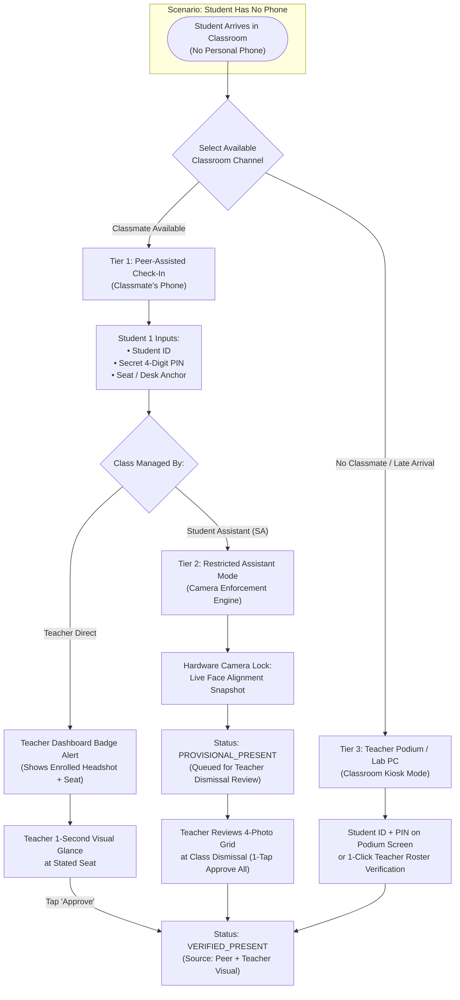
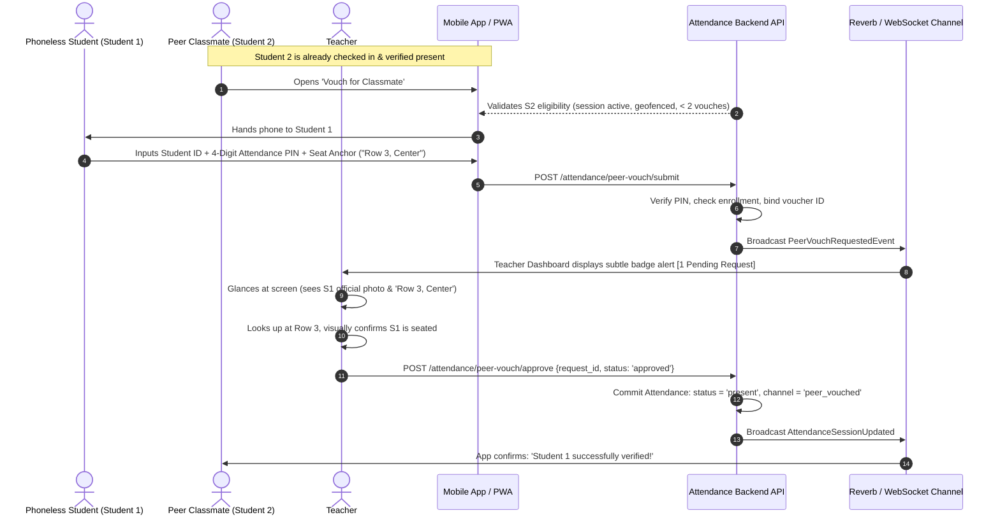
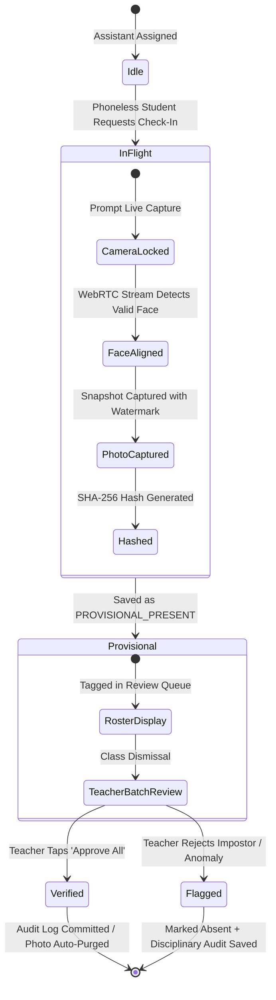
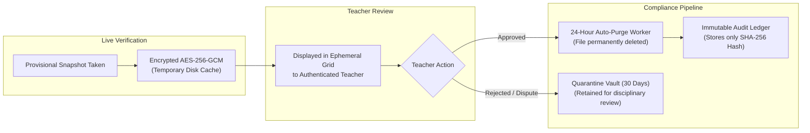

# Alternative Attendance & Student-Verification Solution Design
**System Architecture & Workflow Specification for Phoneless Attendance in a Mobile-First School Environment**

---

## 1. Executive Summary & Problem Context

### 1.1 The Operational Challenge
In modern educational institutions, attendance tracking increasingly relies on student mobile devices (e.g., dynamic QR code scanning, WebAuthn passkeys, BLE beacons, and GPS geofencing). However, real-world school operations introduce everyday failure modes:
* A student forgets their mobile phone at home or loses it in transit.
* A student's phone battery is depleted, or the device suffers a hardware failure (cracked screen, dead camera).
* A student has no personal smartphone due to socioeconomic constraints or strict parental policies.

When attendance policy strictly requires a personal device, a student who is **physically present, engaged, and on time** is categorized as absent or penalized.

### 1.2 Core Design Constraints & Objectives
Any viable alternative must satisfy four competing engineering and operational requirements:

| Dimension | Requirement | Failure Mode to Prevent |
| :--- | :--- | :--- |
| **Zero Hardware Overhead** | Must operate using existing classroom infrastructure (teacher laptop, student peers, lab desktops). No costly biometric kiosks or proprietary RFID scanners required. | Budget bottlenecks, hardware supply chains, and maintenance downtime. |
| **Strict Anti-Fraud Guarantee** | Must prevent "buddy punching" (absent students having friends mark them present) and assistant-student collusion. | Remote check-ins, spoofed photos, and fraudulent attendance inflation. |
| **Teacher Workload Minimization** | The verification flow cannot disrupt lectures or force teachers to manually type student IDs or search rosters during class time. | Teacher resistance, classroom delays, and lost instructional time. |
| **Privacy & Legal Compliance** | Adheres to FERPA, GDPR, and student data protection standards. Eliminates permanent storage of unvetted student candid photos. | Privacy violations, biometric liability, and storage bloat. |

---

## 2. High-Level Architecture: The Tiered Verification Gateway

The solution introduces an **Adaptive 3-Tier Verification Gateway** integrated into the school's existing attendance platform (Laravel backend with WebSockets/Reverb, device binding, and role-based access).



---

## 3. Detailed Workflow Specifications

### Tier 1: Peer-Assisted Vouching with Teacher Visual Confirmation (Primary In-Class Flow)

This flow shifts the physical data entry onto peer devices already in the room, while keeping final authority in the teacher's hands.



#### Step-by-Step Breakdown:
1. **Host Verification Gate**: Student 2 can only launch the "Vouch for Classmate" modal if Student 2 is **already marked `VERIFIED_PRESENT`** in the active session and within the valid classroom geofence.
2. **Classmate Rate Limiting**: Each student is restricted to a maximum of **2 vouches per session**, preventing unauthorized check-in syndicates.
3. **Student Identity Challenge**: Student 1 enters their **Student ID** and their private **4-Digit Attendance PIN** (established at enrollment, separate from general passwords). This prevents an unauthorized classmate from submitting requests for an unsuspecting friend.
4. **Seat / Zone Anchor**: Student 1 selects their current desk or section (e.g., *"Row 3, Center"* or *"Desk 14"*).
5. **Human-in-the-Loop Visual Verification**:
   * The teacher does not experience an intrusive modal or audio prompt.
   * A non-blocking badge count (`[ 1 Pending ]`) appears on the top bar of the Teacher Attendance Dashboard.
   * Tapping the badge opens a quick slide-out panel featuring:
     * Student 1's **enrolled institutional headshot**.
     * Student 1's name and ID.
     * The stated **Seat Anchor** (*"Row 3, Center"*).
     * The name and ID of the voucher (*"Vouched by John Doe"*).
   * The teacher glances toward Row 3, visually identifies the student, and taps **Approve** (taking ~1.5 seconds).

---

### Tier 2: Student Assistant Mode with Live Proof & Batch Review

When a teacher delegates attendance session control to a Student Assistant (SA) or proctor, the system automatically activates **Restricted Delegation Mode**.



#### Key Safeguards in Assistant Mode:
1. **Disabled 1-Tap Approvals**: Student Assistants **cannot** unilaterally approve a peer check-in. The "Approve" button is replaced with a **"Capture Verification Photo"** action.
2. **Hardware Camera Enforcement**:
   * The web application requests direct hardware camera access via `navigator.mediaDevices.getUserMedia({ video: { facingMode: "environment" } })`.
   * Standard file pickers (`<input type="file">`) are disabled to make uploading pre-existing gallery images impossible.
3. **Real-Time Face Framing & Liveness Guard**:
   * The UI renders a circular target overlay.
   * A lightweight client-side face detector ensures that a live human face occupies at least 25% of the frame before the capture button unlocks. This stops assistants from snapping empty desks or floors.
4. **Provisional State**:
   * The check-in is logged with `status: 'provisional_present'`, storing an encrypted thumbnail, capture timestamp, and hardware fingerprint.
5. **Dismissal Batch Review**:
   * At the conclusion of class (or before closing the session), the Teacher Dashboard displays a **"Provisional Check-Ins Grid"** showing 3–4 thumbnail photos alongside official student headshots.
   * The teacher conducts a 5-second scan and clicks **"Approve All"**.

---

### Tier 3: Classroom Podium Terminal / Shared Workstation Kiosk

For edge cases where a student arrives late, does not know anyone in the class, or peer devices are prohibited:

* **Podium Web Kiosk Route**: The teacher's desktop or a shared classroom PC has a secure endpoint (`/attendance/kiosk/{session_token}`).
* **Self-Service Verification**: The student enters their Student ID and 4-digit PIN.
* **Dual Confirmation Modes**:
  * *Option A (Camera Equipped):* The kiosk webcam captures a single thumbnail snapshot and marks the student `PROVISIONAL_PRESENT`.
  * *Option B (No Camera):* The kiosk notifies the teacher's active presentation screen with a discrete desktop toast: *"Mark Jane Smith present at podium? [Accept] [Dismiss]"*.

---

## 4. Anti-Fraud & Security Matrix

To prevent circumvention, each vector of attendance fraud is blocked by a dedicated structural control:

| Fraud Attack Vector | How It Is Attempted | System Defense Mechanism |
| :--- | :--- | :--- |
| **Remote Buddy Punching** | Absent student texts their ID to a friend in the classroom to check them in. | **Two-Factor Barrier & Visual Check:** Friend must enter the secret PIN, and the Teacher Dashboard prompts the teacher to glance at the stated **Seat Anchor**. The teacher immediately detects that the student is not physically in the seat. |
| **Voucher Collusion Syndicate** | One student with a phone charges classmates or acts as an unauthorized check-in kiosk for 10 friends. | **Host Rate Limiting:** Vouchers are hard-capped at **2 peer endorsements per session**. The voucher's own record is permanently linked in the audit log. |
| **Corrupt Student Assistant** | The assistant approves their absent friends or roommates. | **Restricted Delegation Mode:** SAs cannot approve check-ins; they must capture a live photo. The teacher reviews the batch photo grid at dismissal before status becomes final. |
| **Gallery Spoofing / Screen Replay** | An assistant attempts to photograph another phone displaying a photo of the absent student. | **Direct WebRTC Stream & Dynamic Watermarking:** Gallery uploads are blocked. The capture engine applies a cryptographic watermarking overlay (current microsecond timestamp + rotating session salt) across the raw video frame. |
| **Brute-Force PIN Guessing** | A malicious peer attempts to guess another student's PIN. | **Account Lockout:** 3 incorrect PIN attempts locks peer-assisted check-in for that Student ID for 60 minutes and triggers a security notification to the student's email/parent portal. |
| **Off-Campus Voucher Spoofing** | A student outside the campus network attempts to act as a voucher. | **Session Geofence & Subnet Verification:** Voucher must match the active session geofence (derived from the teacher's central laptop coordinates) and local school Wi-Fi subnet. |

---

## 5. Privacy, Ephemeral Storage & Regulatory Compliance

Schools must adhere to strict student privacy legislation (FERPA 34 CFR Part 99, GDPR Article 9 for biometric data, and local privacy acts). Capturing student photographs poses compliance risks if not handled with privacy-by-design.



### Privacy Architecture Policies:
1. **Zero Permanent Biometric Storage**: No facial geometry vectors, landmark embeddings, or biometric templates are stored from live snapshots. Snapshots serve strictly as transient visual verification receipts.
2. **24-Hour Auto-Purge Lifecycle**:
   * All approved provisional snapshots are automatically scheduled for permanent deletion from disk and object storage 24 hours after session closure (`attendance:purge-snapshots` artisan scheduler).
   * The database audit log preserves only the cryptographic **SHA-256 digest** of the file, the verification timestamp, the approving teacher's ID, and the voucher's user ID.
3. **Dispute Quarantine Policy**: If a check-in is rejected or flagged as fraud by the teacher, the image is moved to a restricted, encrypted administrative quarantine bucket for 30 days to support school disciplinary audits, after which it is permanently shredded.

---

## 6. Database Schema Design (Laravel / PostgreSQL / SQLite)

The solution extends the existing application data model cleanly without breaking current QR or WebAuthn tables.

### 6.1 `peer_vouch_requests` Table
Tracks in-flight and historical peer check-in transactions.

```sql
CREATE TABLE peer_vouch_requests (
    id BIGINT UNSIGNED AUTO_INCREMENT PRIMARY KEY,
    session_id BIGINT UNSIGNED NOT NULL,
    subject_id BIGINT UNSIGNED NOT NULL,
    requester_student_id BIGINT UNSIGNED NOT NULL, -- Phoneless student
    voucher_student_id BIGINT UNSIGNED NOT NULL,   -- Peer holding the phone
    seat_zone VARCHAR(64) NOT NULL,               -- e.g., 'Row 3, Center'
    
    -- Security & Verification
    pin_attempts_failed TINYINT UNSIGNED DEFAULT 0,
    snapshot_path VARCHAR(255) NULL,              -- Temporary file storage
    snapshot_hash CHAR(64) NULL,                  -- SHA-256 digest
    
    -- Status & Lifecycle
    status ENUM('pending', 'provisional', 'approved', 'rejected', 'expired') DEFAULT 'pending',
    rejection_reason VARCHAR(128) NULL,
    approved_by_user_id BIGINT UNSIGNED NULL,     -- Teacher or Admin ID
    approved_at TIMESTAMP NULL,
    created_at TIMESTAMP DEFAULT CURRENT_TIMESTAMP,
    updated_at TIMESTAMP DEFAULT CURRENT_TIMESTAMP ON UPDATE CURRENT_TIMESTAMP,
    
    INDEX idx_session_status (session_id, status),
    INDEX idx_requester (requester_student_id),
    INDEX idx_voucher (voucher_student_id),
    CONSTRAINT fk_pvr_session FOREIGN KEY (session_id) REFERENCES attendance_sessions (id) ON DELETE CASCADE,
    CONSTRAINT fk_pvr_requester FOREIGN KEY (requester_student_id) REFERENCES users (id) ON DELETE CASCADE,
    CONSTRAINT fk_pvr_voucher FOREIGN KEY (voucher_student_id) REFERENCES users (id) ON DELETE CASCADE
);
```

### 6.2 Schema Extensions for `attendances` Table
Enhances the primary attendance ledger with verifiable origin channels.

```sql
ALTER TABLE attendances
    ADD COLUMN verification_channel ENUM('mobile_qr', 'webauthn_passkey', 'peer_vouch', 'assistant_provisional', 'teacher_manual', 'kiosk') NOT NULL DEFAULT 'mobile_qr',
    ADD COLUMN is_provisional BOOLEAN NOT NULL DEFAULT FALSE,
    ADD COLUMN peer_vouch_id BIGINT UNSIGNED NULL,
    ADD COLUMN audit_proof_hash CHAR(64) NULL,
    ADD CONSTRAINT fk_att_peer_vouch FOREIGN KEY (peer_vouch_id) REFERENCES peer_vouch_requests (id) ON DELETE SET NULL;
```

---

## 7. Failure Modes, Edge Cases & System Resilience

| Edge Case Scenario | Potential Impact | System Mitigation Strategy |
| :--- | :--- | :--- |
| **Teacher forgets to review provisional list before leaving** | Student status remains stuck in `provisional` indefinitely. | **Automated Grace Period Policy:** At session auto-close, any pending unreviewed provisional records trigger an email digest and push notification to the teacher: *"3 provisional attendance records await your confirmation."* Records default to `provisional_present` for 12 hours before expiring to `unverified_absence` if ignored. |
| **Student forgot their 4-digit PIN** | Phoneless student cannot use the peer vouch modal. | **Teacher Instant Roster Override:** Teacher uses the standard class roster on their laptop to manually toggle the student to `present` with one click (`source: teacher_override`). |
| **Poor Wi-Fi / Temporary Connection Dropout** | Peer phone cannot reach the API server. | **PWA IndexedDB Offline Queue:** The peer app stores the encrypted payload locally with a cryptographic local signature. The request auto-syncs the moment connectivity is re-established within the session window. |
| **Student attempts to vouch twice in different rooms** | Conflicting attendance records across concurrent sessions. | **Unique Session Constraint:** Database row-level locks prevent a user from being associated with more than one active session at the same timestamp. |
