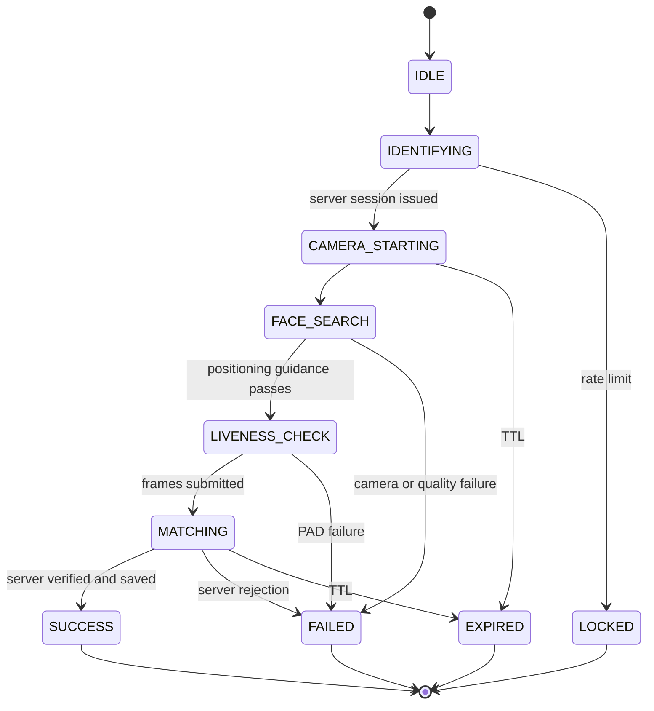

# Peer-Snap FaceMatch architecture

## Trust and flow

```mermaid
sequenceDiagram
  participant H as Authenticated host browser
  participant L as Laravel
  participant D as Attendance database
  participant V as Trusted PAD and face verifier
  participant T as Teacher private channel
  H->>L: POST session (class session, student number)
  L->>D: Check host presence, membership, quota, lockout, enrollment
  D-->>L: Eligible
  L-->>H: Opaque ID, expiry, randomized challenge
  H->>L: POST confirm (ID, live camera frame sequence)
  L->>D: Atomically claim one-use request
  L->>V: Frames, nonce, challenge, enrolled reference
  V-->>L: Face count, PAD, challenge, similarity, model version
  L->>D: Recheck gates; create attendance and consume request atomically
  L->>T: PeerAttendanceVerified
  L-->>H: Success or generic failure
```

The browser owns camera permission and preview only. Laravel owns identity lookup, authorization, attempt counting, quotas, thresholds, and attendance. The verifier owns server-side face detection, quality, active challenge, presentation attack detection (PAD), embedding generation, and comparison with an enrollment it holds. Enrollment references in `peer_face_enrollments` must be provisioned after supervised enrollment by the verifier; existing browser-submitted `webauthn_credentials` descriptors are untrusted and excluded. No template or photo is sent to the host browser. The verifier API must return the exact request ID, nonce, challenge, enrolled subject reference, model version, one face count, PAD outcome, and calibrated similarity. Laravel accepts only an authenticated HTTPS verifier response at the configured endpoint; it never accepts browser-supplied scores. A real verifier and supervised enrollment are deployment dependencies. With either missing, the feature fails closed.



## Threat model and boundaries

| Attack | Control | Residual risk |
| --- | --- | --- |
| Texted student ID or host's own face | ID alone cannot create attendance; trusted one-to-one match and PAD required | Similar-looking relatives, model false accepts |
| Printed image, screen, or video replay | Random challenge, multiple frames, verifier PAD | High-quality replay or presentation artifacts may pass; calibrate with local attack data |
| Browser/API tampering | Server-bound host/subject/session, nonce, one-use state, no client score input | A compromised browser can inject a virtual camera stream; browser APIs cannot prove physical camera provenance |
| Request replay or parallel confirmations | Atomic claim, expiry, unique attendance key, locked final transaction | Distributed deployments require shared database and synchronized clocks |
| Voucher syndicate | Two successful vouchers per host/session by default; failures separately locked | Account sharing and collusion remain possible |
| Student number enumeration | Eligibility checked first; generic student response; per-host and per-subject failed limits | Timing and side-channel review still required |
| False GPS or absent host | Recent verified QR presence and server-recorded geofence result required | Browser GPS is spoofable; approved network/device attestation would strengthen deployment |

## API

All endpoints are same-origin web routes with authenticated student session and CSRF. JSON requests use `Accept: application/json`. `429` means lockout/throttle, `403` ineligible host or subject, `409` duplicate/consumed, `410` expired, `422` bad input or failed verification, `503` missing verifier. Failure responses omit whether a student number exists.

| Route | Input | Output | Limit |
| --- | --- | --- | --- |
| `GET /peer-snap` | none | Mobile camera page | Authenticated student |
| `GET /peer-snap/sessions` | none | Eligible active sessions and remaining vouchers | Authenticated student |
| `POST /peer-snap/session` | `session_id`, `student_number` | Opaque `verification_id`, expiry, challenge | 10/minute plus DB lockout |
| `POST /peer-snap/confirm` | `verification_id`, three JPEG frames | Attendance ID, status | 5/minute plus one-use claim |

The voucher quota counts successful peer attendance only. Failed verification and unknown IDs count toward host lockout. Known subjects also have a per-subject lockout across hosts. Both default to three failures over 30 minutes. A request expires after 2 minutes; the scheduler marks unused requests expired each minute. The server stores attempt metadata and failure codes, never frames. Verified requests include an HMAC over the bound identifiers, attendance ID, and verification time. `PeerVouchRequest::hasValidDecisionMac()` detects edits to those fields or the attendance link while `APP_KEY` remains secret. This is application-level tamper evidence, not protection from a compromised server or an actor with `APP_KEY`; forward structured logs to an append-only external audit sink for stronger evidence. PHP upload temporaries and verifier request buffers are ephemeral; deployments must ensure the verifier does not retain images or log request bodies. No diagnostic image capture exists, so no deletion job is necessary.

## Verifier contract and deployment

Set `PEER_FACE_VERIFIER_URL` to an HTTPS allowlisted verifier endpoint and `PEER_FACE_VERIFIER_TOKEN` to a secret stored outside source control. `PEER_FACE_MODEL_VERSION`, `FACE_MATCH_THRESHOLD`, and `PEER_PAD_THRESHOLD` must match the deployed model's validated calibration. The verifier must authenticate Laravel's bearer token, hold enrollment templates securely, report one-face counts and PAD for **each** frame, verify the challenge sequence, and echo the bound identifiers and nonce. The response contract is documented in `PeerFaceVerifier`. Network failure, timeout, invalid JSON, wrong identity binding, unknown model, missing signals, or low scores reject the attempt. Configure shared database and Reverb, migrate, enroll subjects under supervised consent, then enable the endpoint. Until those steps, users receive an unavailable message.

The app intentionally combines student eligibility lookup and challenge creation into one POST. A separate lookup endpoint would provide an unnecessary student-number enumeration surface. Five JPEG frames are captured across the challenge, at most 350 KiB each. Verifier responses must contain a `frames` array of five objects with integer `face_count`, boolean `quality_passed`, and normalized `pad_score`; plus boolean `challenge_passed`, normalized `similarity`, and exact echoes of `verification_id`, `nonce`, `challenge`, `subject_ref`, and `model_version`. The verifier must reject a sequence that cannot prove the requested gesture, including indeterminate cases. A secure HTTPS deployment is required for browser camera access.

Client-side matching would improve offline operation and reduce server compute, but exposes templates and allows modified JavaScript to forge a score. Server-side matching sends brief frames to a trusted service and needs network and compute, but keeps templates off peer devices and allows an authoritative decision. This implementation chooses server-side matching. Browser `FaceDetector` is only optional preview guidance; it is never PAD or identity proof. Simple blink detection or moiré detection is insufficient. Validate PAD and match thresholds against local camera conditions, demographics, and attack material before production. A privacy/legal review, consent, retention policy, biometric access control, and incident response are required; embeddings are sensitive biometric data and are not automatically GDPR or FERPA compliant.

## Rollout checklist

1. Run `php artisan migrate --force`; set a strong `APP_KEY`, HTTPS app URL, and private Reverb channel credentials.
2. Deploy a separately validated verifier behind a restricted HTTPS endpoint. Verify its no-retention behavior, authentication, timeout handling, challenge interpretation, PAD test results, and exact response contract with real devices.
3. Supervise student enrollment in the verifier, record consent, and provision only the opaque verifier reference, model version, and consent timestamp in `peer_face_enrollments`. Never import the existing browser-provided face descriptors.
4. Calibrate match and PAD thresholds against representative student and attack sets, including printed photos, screens, replay videos, lighting, and camera variation. Set `PEER_FACE_MODEL_VERSION`, `FACE_MATCH_THRESHOLD`, `PEER_PAD_THRESHOLD`, and verifier credentials in the secret store.
5. Keep `php artisan schedule:run` running every minute so expired requests are marked; forward structured logs to an append-only sink and monitor failures and voucher patterns.
6. Complete privacy/legal review, student notice and consent, template deletion/revocation procedure, access controls, incident response, and periodic bias and false-acceptance assessment. Run a real mobile browser and teacher WebSocket end-to-end test before enabling the feature for students.
